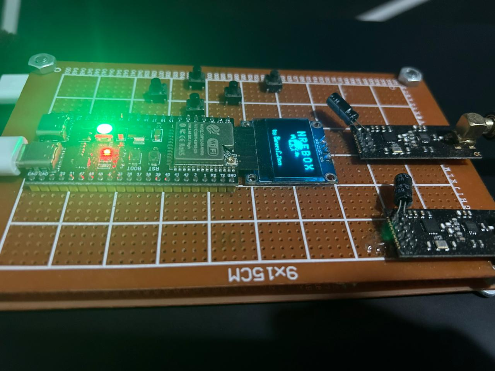
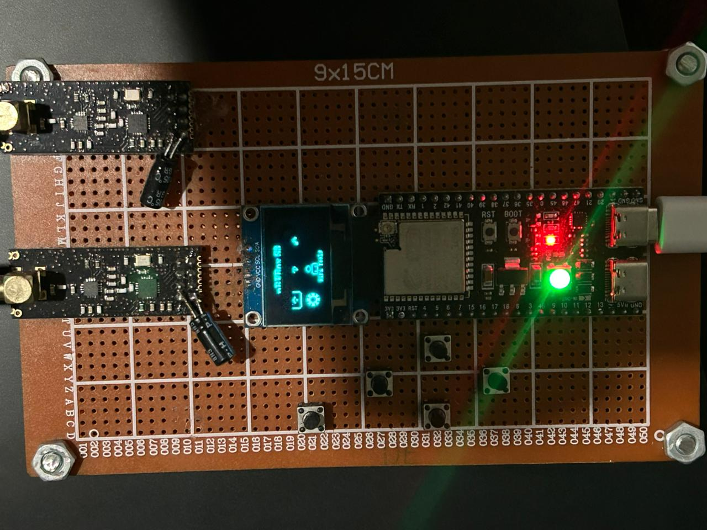
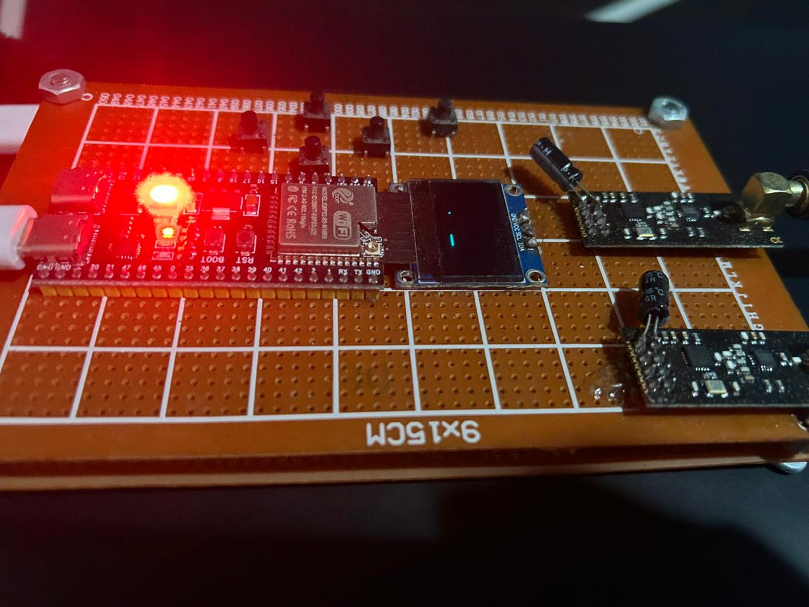
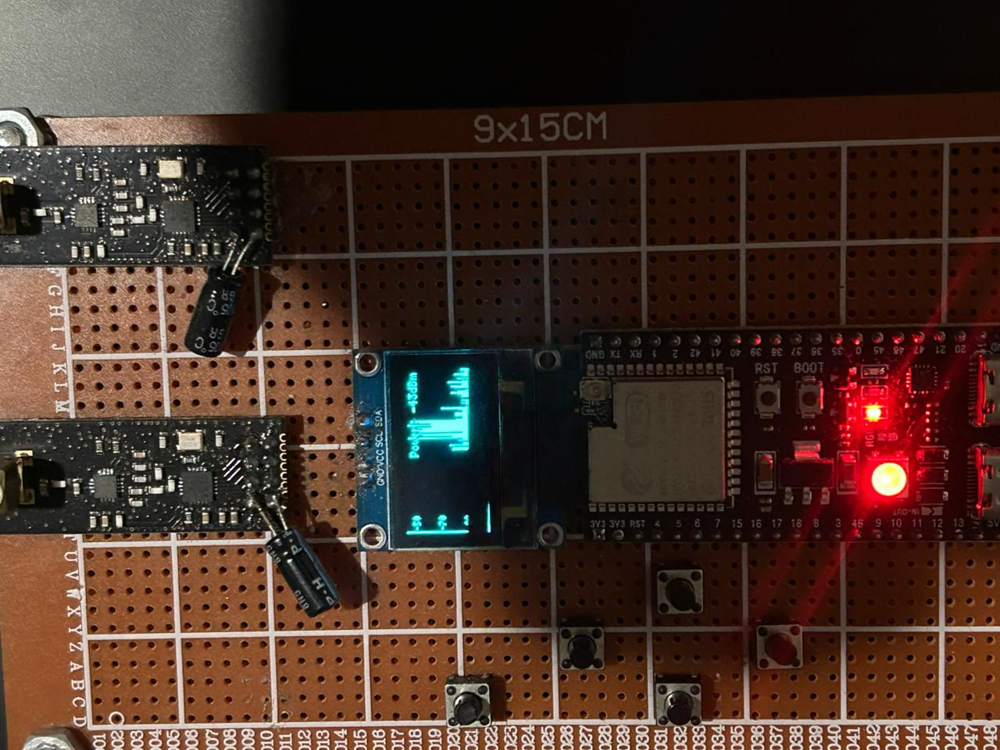
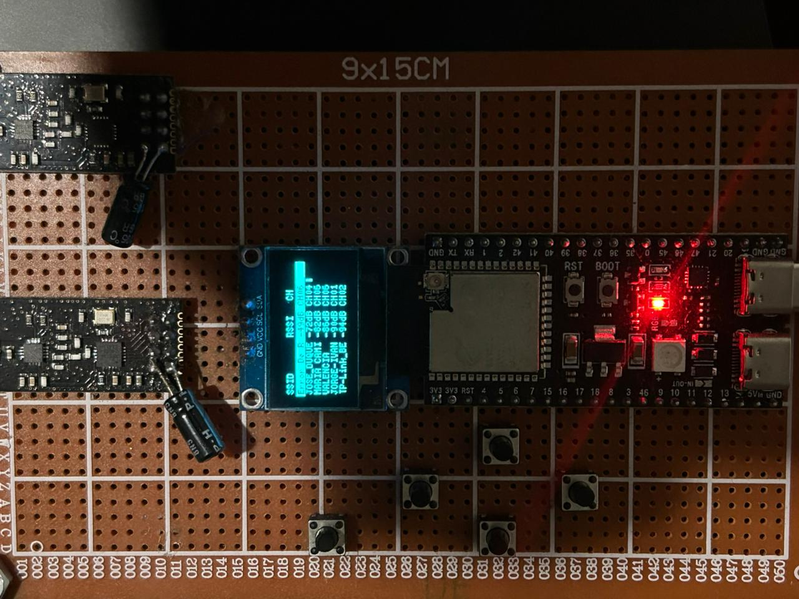
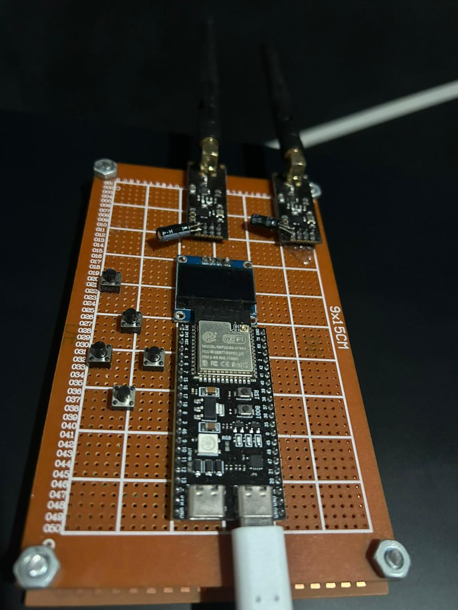
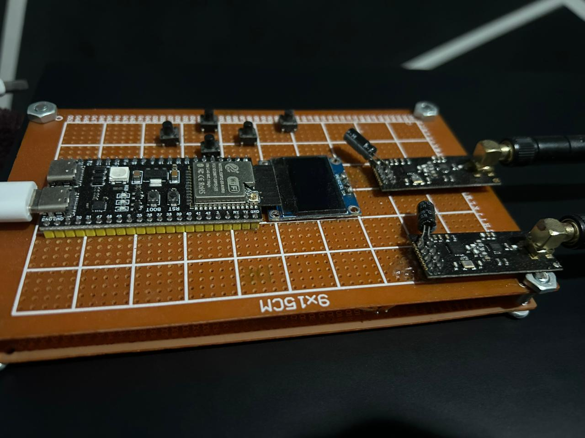

# nRFBox S3 (ESP32-S3 N16R8)

Consola compacta de pruebas inalámbricas para ESP32-S3 con menú en OLED, botones físicos y módulos WiFi/BLE/nRF24. Integra herramientas de escaneo, análisis básico y un portal cautivo de demostración, todo desde una interfaz local sin necesidad de PC.

## Tabla de Contenido
1. Resumen
2. Funcionalidades
3. Hardware Requerido
4. Pinout
5. Stack Tecnológico
6. Estructura del Proyecto
7. Instalación y Carga
8. Configuración
9. Uso
10. Notas de Seguridad y Legal
11. Créditos

## Resumen
Este firmware está diseñado para correr en un ESP32-S3 con pantalla OLED SSD1306, botones físicos y un NeoPixel integrado. Incluye un menú jerárquico con módulos WiFi, BLE y nRF24, además de utilidades de estado y configuraciones básicas.

## Funcionalidades
- Menú gráfico en OLED con navegación por botones.
- WiFi Scan con listado, RSSI y canal.
- Analyzer básico (módulo de análisis RF).
- Captive Portal de demostración con logging en SPIFFS.
- BLE Scan con listado de dispositivos y RSSI.
- BLE Analyzer y Beacon Detector (demo).
- BLE Jammer (módulo dedicado).
- Monitor de estado nRF24 con dos radios A/B.
- Indicadores visuales con NeoPixel.

## Hardware Requerido
- ESP32-S3 (probado con N16R8).
- OLED SSD1306 128x64 I2C.
- Módulo(s) nRF24L01+ (2 radios para A/B).
- Botones físicos (5).
- NeoPixel integrado (GPIO48).

## Pinout
OLED (I2C):
- SDA: `GPIO17`
- SCL: `GPIO18`
- Dirección: `0x3C`

Botones:
- UP: `GPIO13`
- DOWN: `GPIO12`
- LEFT: `GPIO11`
- RIGHT: `GPIO10`
- SELECT: `GPIO9`

nRF24 (Radios A/B):
- CE A: `GPIO5`
- CSN A: `GPIO21`
- CE B: `GPIO15`
- CSN B: `GPIO7`

SPI (nRF24):
- SCK: `GPIO40`
- MOSI: `GPIO41`
- MISO: `GPIO42`

NeoPixel:
- Data: `GPIO48`

## Stack Tecnológico
- Arduino (ESP32 Core)
- C/C++ (Arduino framework)
- U8g2 (OLED)
- Adafruit SSD1306 (boot animation)
- Adafruit NeoPixel
- RF24 (nRF24L01+)
- WiFi / BLE (ESP32 Core)
- WebServer + DNSServer (portal cautivo)
- SPIFFS, EEPROM, SD, Update

## Estructura del Proyecto
```
nRFBoxESP32-S3_N16R8/
├── nRFBox.ino
├── config.h
├── icon.h
├── boot_animation.* 
├── wifi_module.*
├── bluetooth_module.*
├── ble_jammer_module.*
├── analyzer_module.*
├── captive_portal_module.*
├── nrf_module.*
├── setting.*
└── neopixel.*
```

## Instalación y Carga
1. Instala Arduino IDE 2.x.
2. Instala el soporte de placas ESP32 (Espressif).
3. Instala las librerías:
   - `U8g2`
   - `Adafruit SSD1306`
   - `Adafruit NeoPixel`
   - `RF24`
4. Abre `nRFBoxESP32-S3_N16R8/nRFBox.ino`.
5. Selecciona una placa ESP32-S3 y el puerto correcto.
6. Compila y sube.

## Configuración
Los pines y opciones de hardware se encuentran en `nRFBoxESP32-S3_N16R8/config.h`.  
Si cambias el cableado, actualiza esos defines antes de compilar.

Opcionales:
- SD y OTA definidos en `config.h` (`SD_CS_PIN`, `FIRMWARE_FILE`).
- Logs del Captive Portal se guardan en SPIFFS (`/logs.csv`).

## Uso
Navegación:
- `UP/DOWN/LEFT/RIGHT` para moverte por el menú.
- `SELECT` para entrar en módulos.
- `LEFT` dentro de un módulo para volver.

Menú principal:
- WiFi Tools
- BLE Tools
- nRF24
- Settings
- About

## Capturas





## Galería




## Notas de Seguridad y Legal
Este proyecto incluye módulos que pueden interferir con redes o dispositivos inalámbricos. Úsalo solo en entornos controlados y con autorización expresa. El uso indebido puede ser ilegal y causar interferencias a terceros.

## Créditos
- Autor: General_Jhon
- Proyecto: nRFBox S3 (ESP32-S3 N16R8)

## Créditos y Atribución
Este firmware está basado en el proyecto original nRFBox de CiferTech.  
El código fue adaptado para **ESP32-S3 N16R8**, con cambios importantes en pines, módulos y flujo interno para lograr compatibilidad y funcionamiento estable en este hardware.

Proyecto original: `https://github.com/cifertech/nRFBox`
